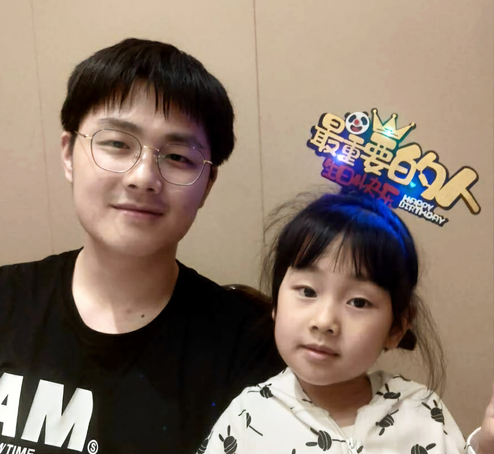

&nbsp;

<h2 id='about-me'>About Me</h2>

一只无可救药的屑妹控，完全不懂深度学习，文章都是乱写的，写博客的目的是为了逃避做实验hhh。

### Education experience

- B.S. in Mathematics, [Beihang University](https://www.buaa.edu.cn/) (2015~2019)
- M.S. in Mathematics, [Beihang University](https://www.buaa.edu.cn/) (2019~2021)
- ...

### Direction of interest

- Computer Vision
- 3D Point Cloud
- Machine Learning

### Contact information

- GitHub: [https://github.com/Theigrams](https://github.com/Theigrams)
- E-mail: theigrams@buaa.edu.cn

